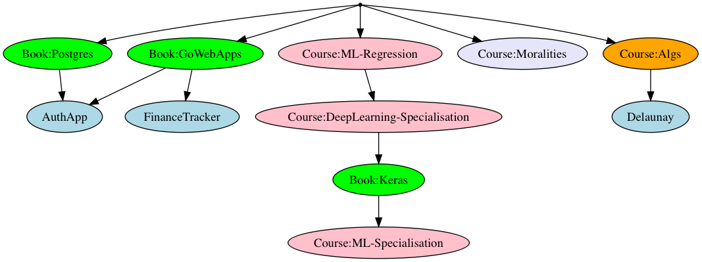

# Study Plan

## Computer Science

#### [Standford University Algorithms Specialisation]()

- [X] [Divide and Conquer, Sorting and Searching, and Randomized Algorithms](https://www.coursera.org/learn/algorithms-divide-conquer) -- [Final grade: 96%](https://www.coursera.org/account/accomplishments/certificate/C3AEPVS8ECEF)
- [X] [Graph Search, Shortest Paths, and Data Structures](https://www.coursera.org/learn/algorithms-graphs-data-structures) -- [Final Grade: 94%](https://www.coursera.org/account/accomplishments/certificate/ZU39YDML8F4D)
- [ ] [Greedy Algorithms, Minimum Spanning Trees, and Dynamic Programming](https://www.coursera.org/learn/algorithms-greedy)
- [ ] [Shortest Paths Revisited, NP-Complete Problems and What To Do About Them](https://www.coursera.org/learn/algorithms-npcomplete)

Repo: https://github.com/timaraxian/algorithms

## Machine Learning

#### [University of Washington - Machine Learning Specialisation](https://www.coursera.org/specializations/machine-learning)

- [ ] [Machine Learning Foundations: A Case Study Approach](https://www.coursera.org/learn/ml-foundations)
- [X] [Machine Learning: Regression](https://www.coursera.org/learn/ml-regression) -- [Final grade: 99.5%](https://www.coursera.org/account/accomplishments/certificate/YEJXESA3292Z)
- [ ] [Machine Learning: Classification](https://www.coursera.org/learn/ml-classification)
- [ ] [Machine Learning: Clustering & Retrieval](https://www.coursera.org/learn/ml-clustering-and-retrieval)

Repo: https://github.com/timaraxian/ml-study

#### [deeplearning.ai - Deep Learning Specialisation](https://www.coursera.org/specializations/deep-learning)

- [ ] [Neural Networks and Deep Learning](https://www.coursera.org/learn/neural-networks-deep-learning)
- [ ] [Improving Deep Neural Networks: Hyperparameter tuning, Regularization and Optimization](https://www.coursera.org/learn/deep-neural-network)
- [ ] [Structuring Machine Learning Projects](https://www.coursera.org/learn/machine-learning-projects)
- [ ] [Convolutional Neural Networks](https://www.coursera.org/learn/convolutional-neural-networks)
- [ ] [Sequence Models](https://www.coursera.org/learn/nlp-sequence-models)

#### [deeplearning.ai - Introduction to TensorFlow for Artificial Intelligence, Machine Learning, and Deep Learning](https://www.coursera.org/learn/introduction-tensorflow)

## Mathematics

todo

## Books

- [ ] [PostgreSQL: Up and Running](https://www.oreilly.com/library/view/postgresql-up-and/9781449326326/)
- [ ] [Let's Go!](https://lets-go.alexedwards.net/)
- [ ] [Deep Learning with Python](https://www.manning.com/books/deep-learning-with-python)

## Other

#### [Yale University - Moralities of Everyday Life](https://www.coursera.org/learn/moralities)

## Projects

- [ ] [Sudoku Solver](https://github.com/timaraxian/sudoku-solver)
- [ ] Auth app
- [ ] Delaunay Triangulation
- [ ] Finance Tracker
